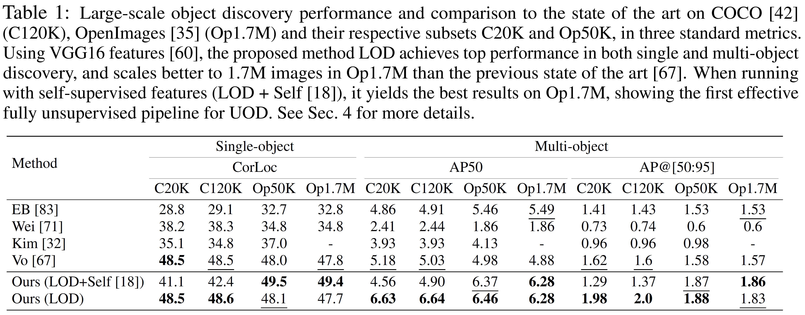

# Large-Scale Unsupervised Object Discovery

Huy V. Vo, Elena Sizikova, Cordelia Schmid, Patrick Pérez, Jean Ponce
[[PDF]](https://arxiv.org/pdf/2106.06650.pdf)

We propose a novel ranking-based large-scale unsupervised object discovery algorithm that scales up to 1.7M images.


This repository contains code used in the paper. 

## Quantitative Results


## Installation
Follow [INSTALL.md](docs/INSTALL.md) and [DATA.md](docs/DATA.md) to install `LOD` and prepare data for running it.

## Run LOD on a small toy dataset
Follow [GETTING_STARTED_small_dataset.md](docs/GETTING_STARTED_small_dataset.md) to run `LOD` with VGG16 features on a small subset of 60 images of Pascal VOC2007 dataset.

## Getting Started 
Follow [GETTING_STARTED.md](docs/GETTING_STARTED.md) to run `LOD` with VGG16 features and [GETTING_STARTED_OBOW.md](docs/GETTING_STARTED_OBOW.md) with VGG16-based OBoW features on C20K dataset.

## Citations

```
@inproceedings{Vo21LOD,
  title     = {Large-Scale Unsupervised Object Discovery},
  author    = {Vo, Huy V. and Sizikova, Elena and Schmid, 
               Cordelia and P{\'e}rez, Patrick and Ponce, Jean},
  booktitle = {Advances in Neural Information Processing Systems 34 (NeurIPS 2021)}
  year      = {2021},
}
```

## Acknowledgments

This work was supported in part by the Inria/NYU collaboration, the Louis Vuitton/ENS chair on artificial intelligence and the French government under management of Agence Nationale de la Recherche as part of the “Investissements d’avenir” program, reference ANR19-P3IA-0001 (PRAIRIE 3IA Institute). Elena Sizikova was supported by the Moore-Sloan Data Science Environment initiative
(funded by the Alfred P. Sloan Foundation and the Gordon and Betty Moore Foundation) through the NYU Center for Data Science. Huy V. Vo was supported in part by a Valeo/Prairie CIFRE PhD Fellowship.

### License

This project is licensed under the MIT License - see the [LICENSE](LICENSE) file for details.
